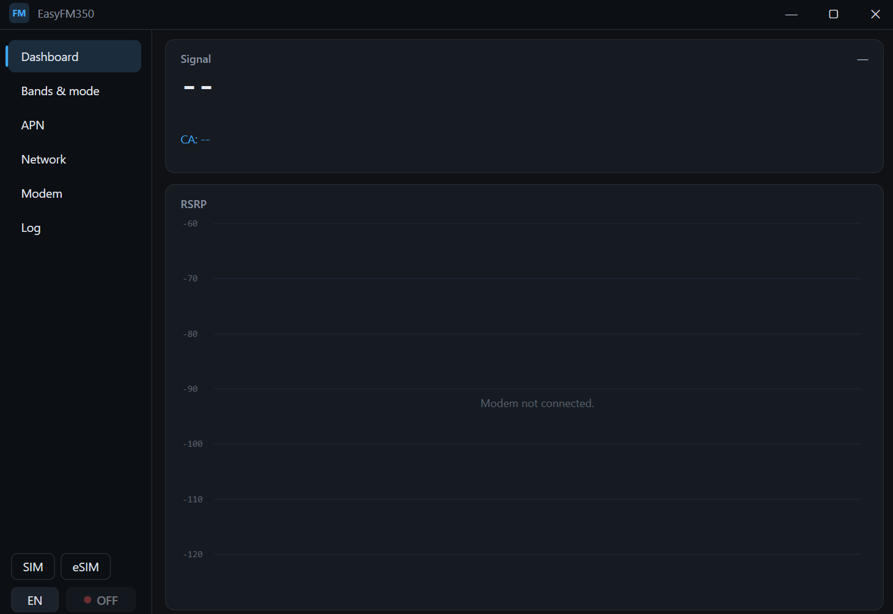

<h1 align="center">EasyFM350</h1>

  

Windows app for managing a **Fibocom FM350-GL** 5G modem over its AT (COM) port and NCM network interface.

## Features

- **Dashboard** - live RSRP/RSRQ/SINR chart, band, carrier aggregation, temperature, current PDN address, connection state.
- **Bands & mode** - LTE/NR band selection, RAT presets (Auto / 5G+4G / LTE / 3G / 5G SA), 5G NSA/SA options.
- **Connection** - APN management (empty APN = network-assigned), one-click connect, automatic Windows interface setup (IP, DNS, routes), reconnect on PDN drop, recovery from modem quirks (activation rejections, missing gateway/mask, wedged contexts).
- **Network sharing** - built-in local HTTP proxy bound to the modem interface.
- **SIM / eSIM** - physical SIM ↔ eSIM slot switching; eSIM profile management through a bundled **[lpac](https://github.com/estkme-group/lpac)**  talking APDU over AT.
- **Device** - IMEI/IMSI, firmware and RF versions, calibration status, dual-SIM state, sensor temperature.

## Requirements

- Windows 10/11 x64
- FM350 exposing an **AT port** ("MD AT Port") and an **NCM** network adapter
- Administrator rights

## Install

Download `EasyFM350-win-x64.exe`and run.

## Third-party components

- **[lpac](https://github.com/estkme-group/lpac)** — the eSIM LPA that performs the actual profile operations.
